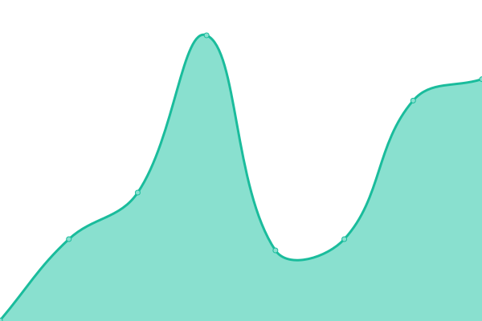
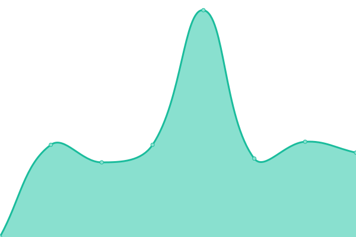
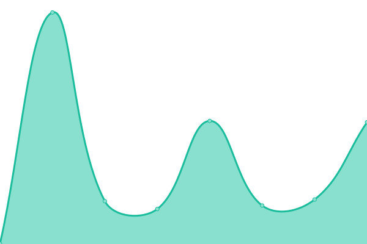
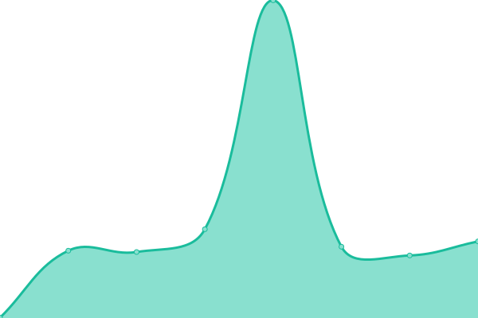

# [📈 Live Status](https://triadhosting.github.io/upptime): <!--live status--> **🟩 All systems operational**

This repository contains the open-source uptime monitor and status page for [triadhosting](https://triadhosting.github.io/upptime), powered by [Upptime](https://github.com/upptime/upptime).

With [Upptime](https://upptime.js.org), you can get your own unlimited and free uptime monitor and status page, powered entirely by a GitHub repository. We use [Issues](https://github.com/triadhosting/upptime/issues) as incident reports, [Actions](https://github.com/triadhosting/upptime/actions) as uptime monitors, and [Pages](https://triadhosting.github.io/upptime) for the status page.

<!--start: status pages-->
<!-- This summary is generated by Upptime (https://github.com/upptime/upptime) -->
<!-- Do not edit this manually, your changes will be overwritten -->
<!-- prettier-ignore -->
| URL | Status | History | Response Time | Uptime |
| --- | ------ | ------- | ------------- | ------ |
|  [WEB01](https://triadhosting01.com) | 🟩 Up | [web-01.yml](https://github.com/triadhosting/upptime/commits/HEAD/history/web-01.yml) | 

 192ms
     
 | 

<a href="https://status.triadhosting.com/history/web-01">100.00%</a>
    

|  [WEB02](https://triadhosting02.com) | 🟩 Up | [web-02.yml](https://github.com/triadhosting/upptime/commits/HEAD/history/web-02.yml) | 

 349ms
     
 | 

<a href="https://status.triadhosting.com/history/web-02">100.00%</a>
    

|  [WEB03](https://triadhosting03.com) | 🟩 Up | [web-03.yml](https://github.com/triadhosting/upptime/commits/HEAD/history/web-03.yml) | 

 354ms
     
 | 

<a href="https://status.triadhosting.com/history/web-03">100.00%</a>
    

|  [WEB05](https://triadhosting05.com) | 🟩 Up | [web-05.yml](https://github.com/triadhosting/upptime/commits/HEAD/history/web-05.yml) | 

 390ms
     
 | 

<a href="https://status.triadhosting.com/history/web-05">100.00%</a>
    

|  [WEB08](https://triadhosting08.com) | 🟩 Up | [web-08.yml](https://github.com/triadhosting/upptime/commits/HEAD/history/web-08.yml) | 

 371ms
     
 | 

<a href="https://status.triadhosting.com/history/web-08">100.00%</a>
    

|  [WEB09](https://triadhosting09.com) | 🟩 Up | [web-09.yml](https://github.com/triadhosting/upptime/commits/HEAD/history/web-09.yml) | 

 376ms
     
 | 

<a href="https://status.triadhosting.com/history/web-09">100.00%</a>
    

|  [WEB10](https://triadhosting10.com) | 🟩 Up | [web-10.yml](https://github.com/triadhosting/upptime/commits/HEAD/history/web-10.yml) | 

 183ms
     
 | 

<a href="https://status.triadhosting.com/history/web-10">100.00%</a>
    

|  [WEB11](https://triadhosting11.com) | 🟩 Up | [web-11.yml](https://github.com/triadhosting/upptime/commits/HEAD/history/web-11.yml) | 

 365ms
     
 | 

<a href="https://status.triadhosting.com/history/web-11">100.00%</a>
    

<!--end: status pages-->

[**Visit our status website →**](https://triadhosting.github.io/upptime)

## 📄 License

- Powered by: [Upptime](https://github.com/upptime/upptime)
- Code: [MIT](./LICENSE) © [triadhosting](https://triadhosting.github.io/upptime)
- Data in the `./history` directory: [Open Database License](https://opendatacommons.org/licenses/odbl/1-0/)
